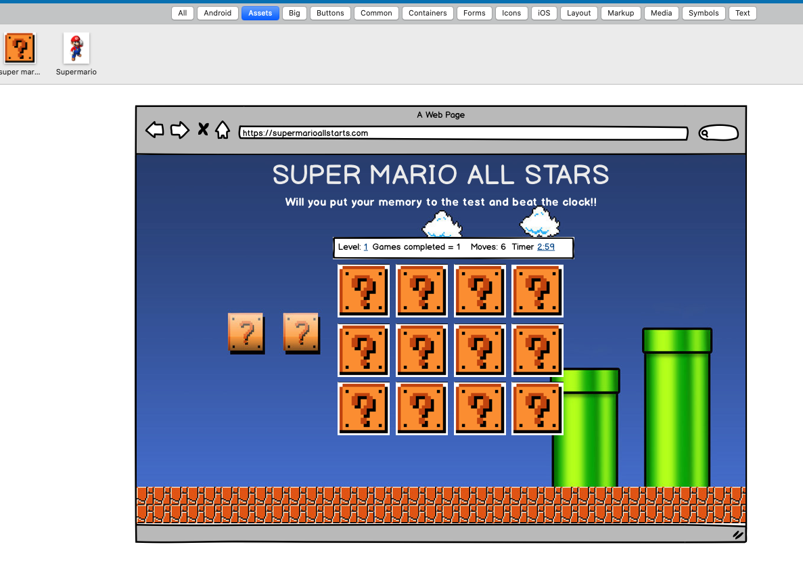
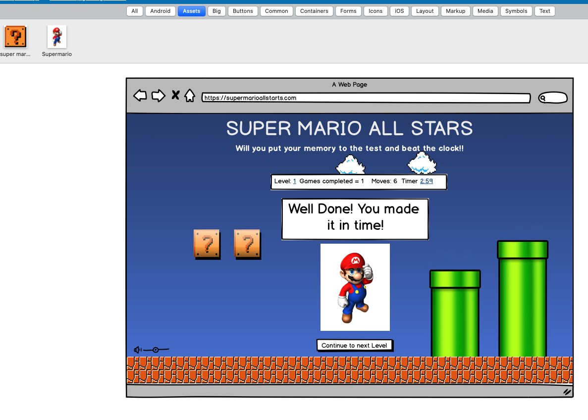
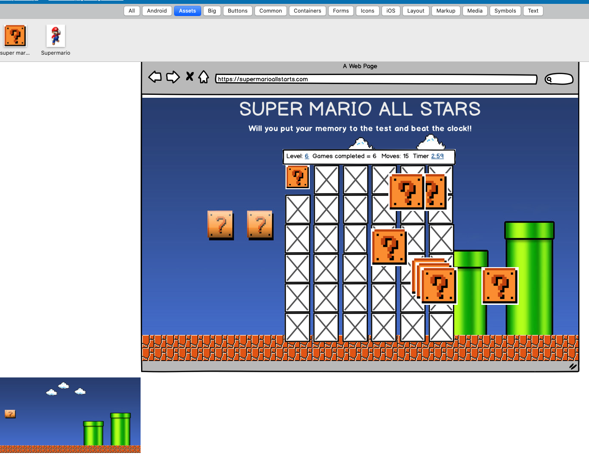
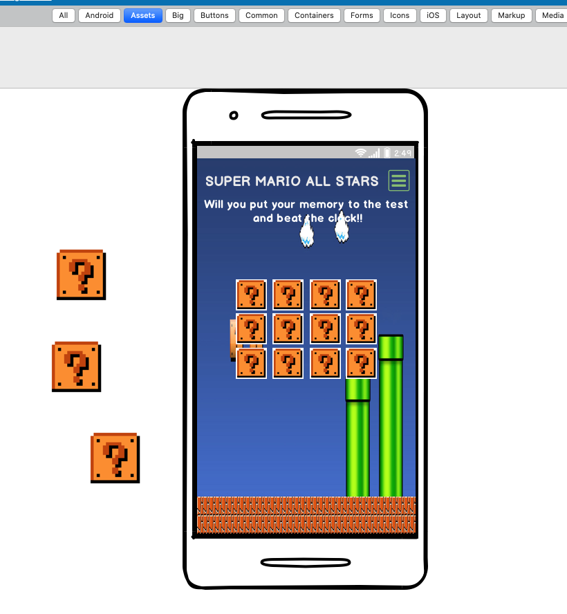
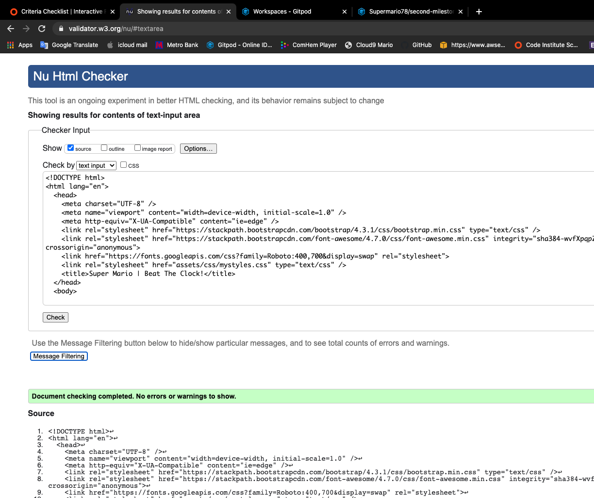
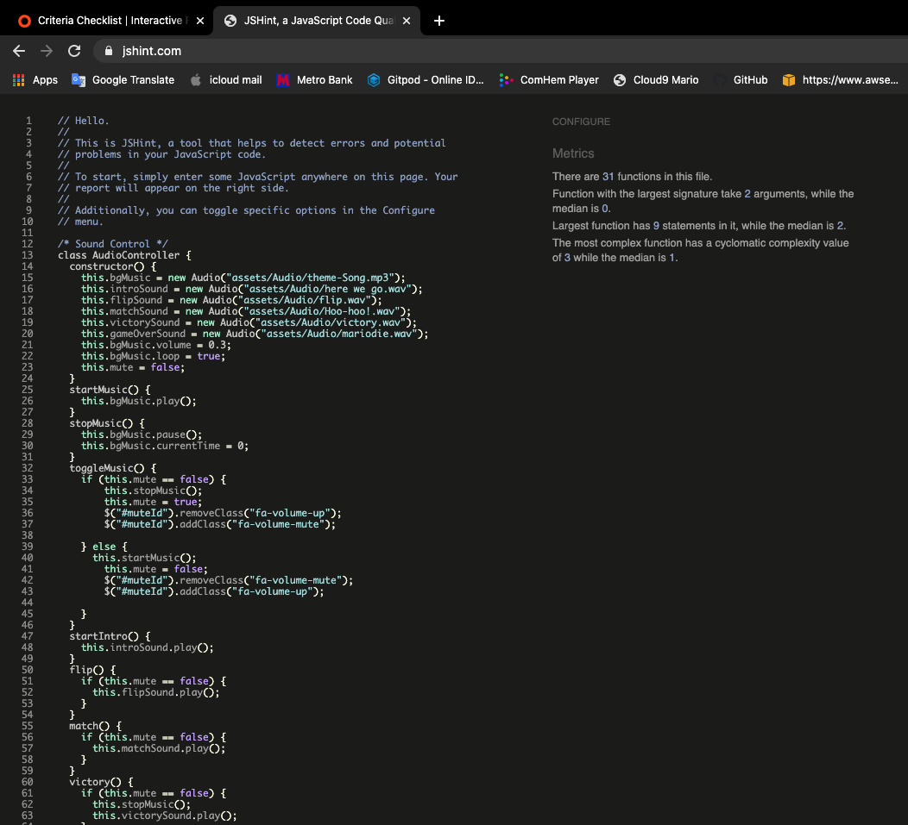
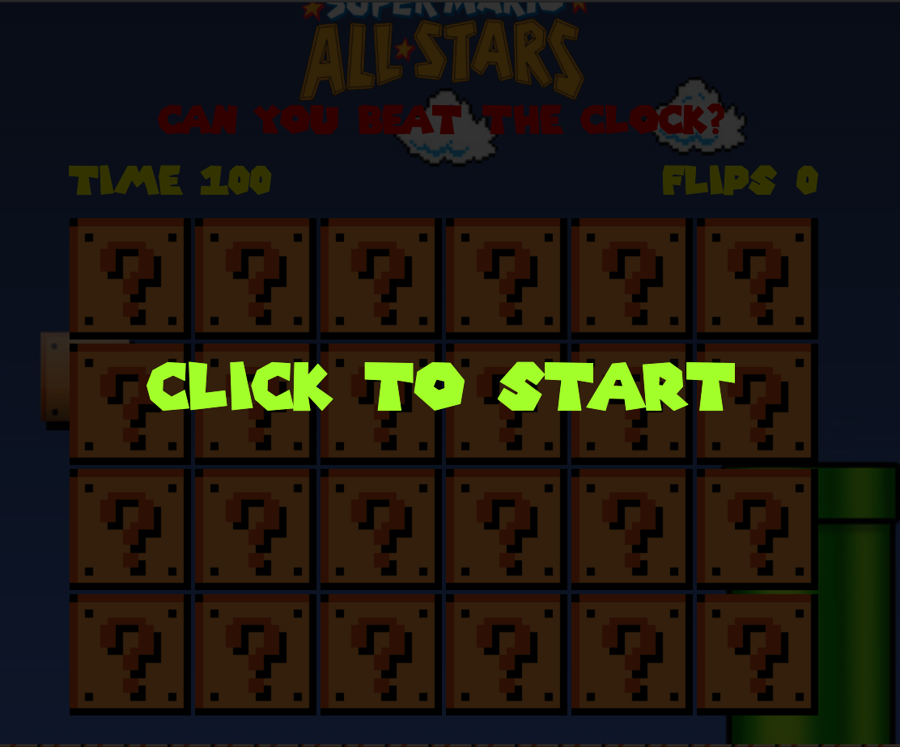
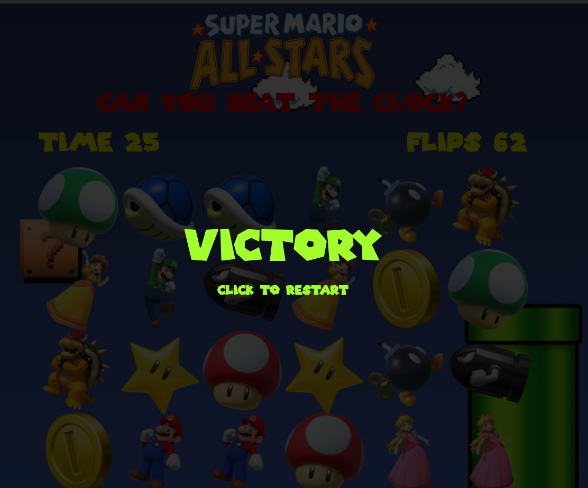

# Second Milestone Project - Super Mario All Stars - Beat The Clock!

**Version 1.0.0**

I choose to take the oportuntiy to exercise all my new Java Script knowledge alongside my learned skills on HTML5 and CSS3 for this Milestone Project by putting together this rather fun Memory Match card game with a personal favorite theme.
My goal with this project is to showcase my practical understanding of the JavaScript fundamentals, covering a large variarety of functions, events and utilising algorithms such as the Fisher-Yates shuffle algorithm, which i used on this project.

---

## UX

My UX process was based on trying to develop a simple, easy to the eye game, navigable layout enabling a logical and intuitive response for the user to play and achive the target explained on the top of the page.
At the initial stage of my UX design I used the already familiar Balsamiq wireframe, which allowed me to sketch a visual picture of which design will be more effective on achieving my desired result to the user.

The reason why you can see differences between my original wireframes and the actual page because changes happened during development process. I did not find the need to create any more detailed mockups because the design is so straight forward and I already had seen how my cards look together.

Balsamiq Screenshots

| Early Comcept | Victory Screen | Original Grid | Mobile View |
|---------------|----------------|---------------|-------------|
|  |  |  |  |

### User Feedback

-As the first time playing this game on Mario's web page, I found his memory card match game easy to play, user friendly and with intuitive navigation, the background music gave me an instant feel of nostalgia for Super Mario game
 the count down timer made the game even more exciting as you try to complete matching all the cards with less possible number of flips before the time is up! great fun!
Overall, it is a great effort but with room for improvement, the game can be enhance with adding difficulty levels and more sound effects.
 
-As a friend, i played from a link on my iphone and realise the game needed some fixes on the cards background as they were not fliping when clicking on the while using safari broswer.

---

## Features

* **Media** - Allows users to get an audio and visual experience of the game and what JavaScript can offer with HTML and CSS, images, text and audio files.

---

## Technologies Used

1. [Balsamiq Wireframe](https://balsamiq.com/){:target="_blank"}
     - Used at the beginning of the project to develop the right UX design desired for mobile and desktop resolutions.
2. [HTML5](https://en.wikipedia.org/wiki/HTML5){:target="_blank"}
     - Used mainly to modify and add structure from Bootstrap
3. [CSS3](https://en.wikipedia.org/wiki/Cascading_Style_Sheets#CSS_3){:target="_blank"}
     - Allowed me to personalise colors, buttons, forms and visual details to my personal style.
4. [Markdown](https://guides.github.com/features/mastering-markdown/){:target="_blank"}
     - Used to compone Readme page.
5. [Fontawesome](https://fontawesome.com/){:target="_blank"}
     - Used for all my footer icons
6. [Google Fonts](https://fonts.google.com/){:target="_blank"}
     - Provided me with fonts for all my pages such as Exo and Roboto font.
7. [FontFamily](https://db.onlinewebfonts.com/t/6c02f15fdbc9dd7c482b52b06d8e0a6c.eot){:target="_blank"}
     - I used Super Mario 256 FontFamily from onlinewebfonts to create all the text on the index page.
8. [GitHub](https://github.com/){:target="_blank"}
     - I uploaded my projects on a regular basis on github and also used it as a source of information and tool to learn even how to write this ReadMe.
9. [Google.com](https://www.google.com/){:target="_blank"}
     - For every answer I needed to continue learning and developing my project, much credit also to youtube for the vast amount of videos and tutorials.

---

## Testing

I have gone to a great length to make sure testing was done to the best of my abiliy. 
I had issues with errors getting the volume icons to toggle on click for mute and unmute of the sound but got it fixed at the end.

All responsiveness tests have been performed on the following devices:

- Samsung A5 (landscape/portrait)
- Samsing A7 (landscape/portrait)
- PC (resolutions 1920x1080 and 1366x768)
- IphoneX (landscape/portrait, very low width viewport, using chrome developer tools)
- Ipad (landscape/portrait, using chrome developer tools)
- General responsive testing with chrome developer tools.

### Code Checking

I have checked and worked on all the necessary corrections to make sure all my pages where CCS3 And HTML5 approved, I had 0 errors on HTML5 and 0 on CSS3 to fix.

- Validators Screenshots

|   HTML5   |   CSS3   | JavaScript |
|-----------|----------|------------|
|  |  |  |

### Web Browsers

I have run my project on Firefox, Google Chrome, Brave and Safari and found no issues on desktop mode.

On Safari mobile view, I did found some issues on the background cards no fliping correctly on click, I managed to fix the page further, but it could still have a more smoother transition as you can see from the video test below.

## Deployment

I choose to deploy this project on GitHub Pages, below are the steps I used to deploy.

- Log into my github profile page and click on my project's name,
- clicked on settings,
- scroll down the page to GitHub Pages,
- under Source, selected master branch and [Second Milestone Project - Super Mario All Stars - Beat The Clock!](https://supermario78.github.io/second-milestone-project/){:target="_blank"} to view.

## Credits

### Code
* HTML and CSS part of the [tutorial](https://www.youtube.com/watch?v=28VfzEiJgy4){:target="_blank"} 
* Javascript [tutorial 1](https://www.youtube.com/watch?v=3uuQ3g92oPQ){:target="_blank"}  
* [StackOverflow](https://stackoverflow.com/questions/60885320/inserts-a-div-and-a-link-into-the-div-twice-and-does-this-with-several-links-js){:target="_blank"}
* [Fisher–Yates shuffle](https://en.wikipedia.org/wiki/Fisher%E2%80%93Yates_shuffle){:target="_blank"}

### Images
* [Super Mario Characters](https://i.pinimg.com/originals/1c/c6/19/1cc61968cf9336a6c7a7a36b352b9abc.jpg){:target="_blank"}
* [Back of the Card Question Mark](https://github.com/taniarascia/memory/blob/master/img/question.gif){:target="_blank"}
* [All Stars Logo](https://i.pinimg.com/564x/38/b0/99/38b099f5541f2ca56bbe5ed9a21ae191.jpg){:target="_blank"}
* [Volume Up and Mute Icon](https://fontawesome.com/icons/volume-up?style=solid){:target="_blank"}
* [Background visual](https://farm5.staticflickr.com/4062/5169154193_4b8a5a7a80_b.jpg){:target="_blank"}

### Audio
* [Card flip](https://raw.githubusercontent.com/Zackazt/Mix-Or-Match/tutorial-code/Assets/Audio/flip.wav){:target="_blank"}
* [Matched](https://themushroomkingdom.net/media/drm64/wav){:target="_blank"}
* [Intro - Here we Go!](https://themushroomkingdom.net/sounds/wav/drm64_mario5.wav){:target="_blank"}
* [Victory](https://themushroomkingdom.net/sounds/wav/smb/smb_stage_clear.wav){:target="_blank"}
* [Game over](https://themushroomkingdom.net/sounds/wav/smb/smb_gameover.wav){:target="_blank"}
* [Background audio](https://mp3cdnb.ytjar.xyz/get.php/N/NTa6Xbzfq1U.mp3?h=pGf1VAy2GWbLx3iZKt-Tbg&s=1593477517&n=Super-Mario-Bros-Theme-Song){:target="_blank"}

### Content

- Screenshots pictures taken by myself

|  Click Star   |    Game Over   |    Victory    |   Game on   |
|---------------|----------------|---------------|-------------|
|  |  |  |  |

## Acknowledgements

- I wanted to dedicate this project to my wondeful 2 year old daughter Abigail.
- Massive Thank you to my study buddy Wouter, all your help checking up on how im doing , help me kept going.
- Thanks to all the Code Institute Slack community, there was always someone at 2am happy to help. 
- A massive thanks to my brilliant, patience, knowledgeble and helpful mentor, Anthony Montaro (Tony Montana of the coding word)for all his support and guidance every step of the way.
- And last but most important, want to acknowledge my amazing wife Jessica, without her never ending support during the entire course project, I would have never get anything done.
## Disclaimer
This project is for educational purposes only. no materials/files are intended for any commercial use. In this document all sources will be credited.

